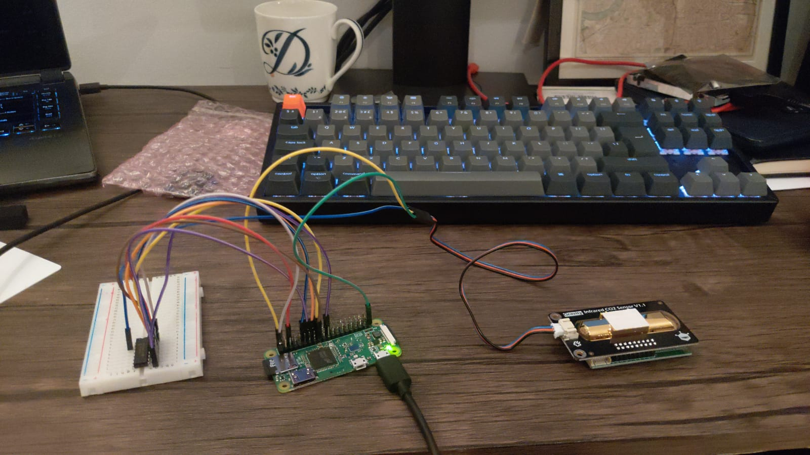
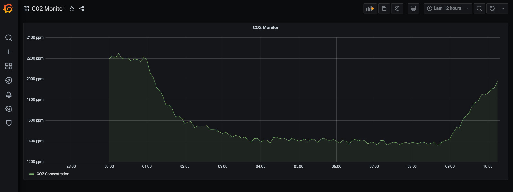

# Air Quality Monitoring Project
An attempt to make a home CO2 Monitor using a Raspberry Pi Zero as the microcontroller along with an Infrared CO2 Sensor. Values are stored in InfluxDB and visualised in Grafana.

 
 
 
Example output showing the effect of opening the balcony door overnight and then closing it again in the morning:

 
 

The values do seem a little on the high side. I'm unsure whether that's a poor reflection of the air quality in a small city centre flat or whether the sensor itself needs calibrating down a bit.

If you want to have a go at putting something similar together you can follow the [Setup Guide](Setup_Guide.md).
