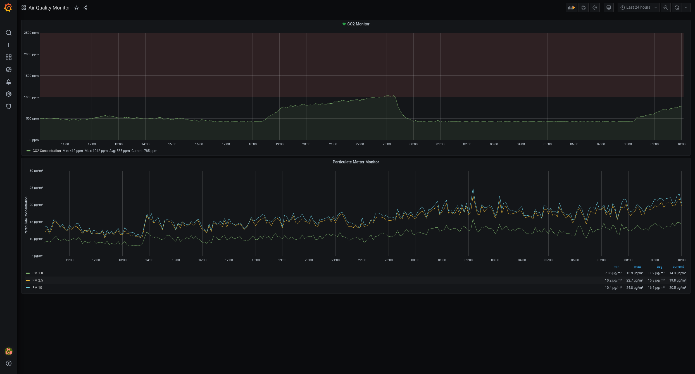

# Air Quality Monitoring Project
An attempt to make a home Air Quality Monitor using a Gravity Infrared CO2 sensor and a Pimoroni laser scattering particulate matter sensor using a Raspberry Pi Zero as the microcontroller. Values are stored in InfluxDB and visualised in Grafana.

 
 
 
Example output:

 
 

If you want to have a go at putting something similar together you can follow the [Setup Guide](setup_guide.md).
