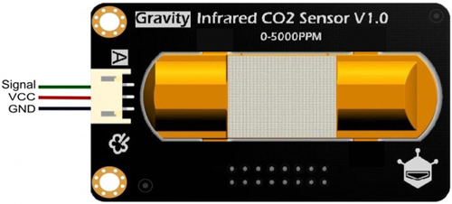
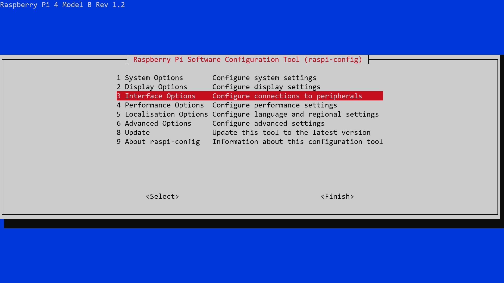
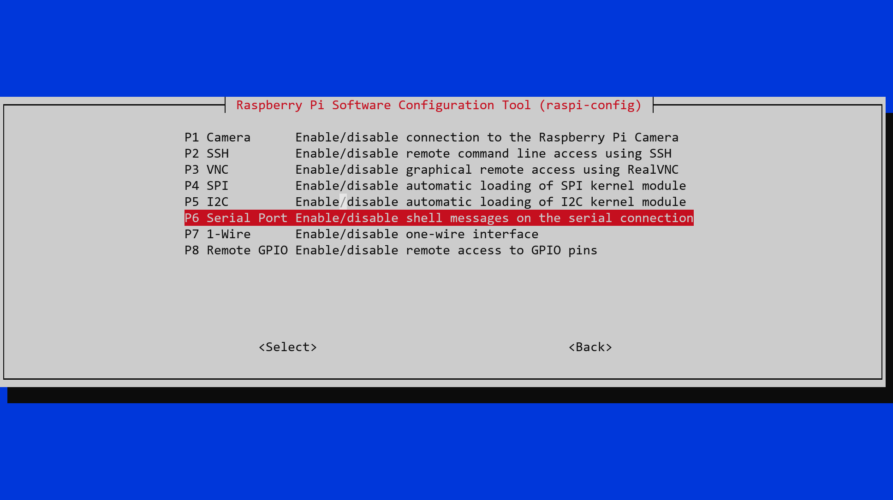
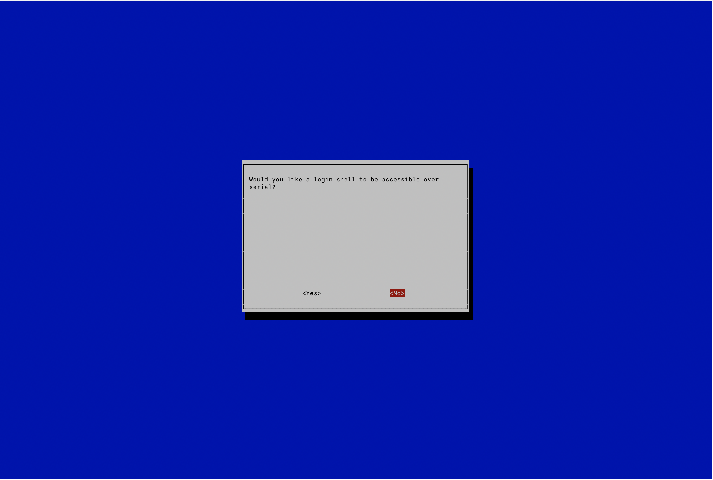
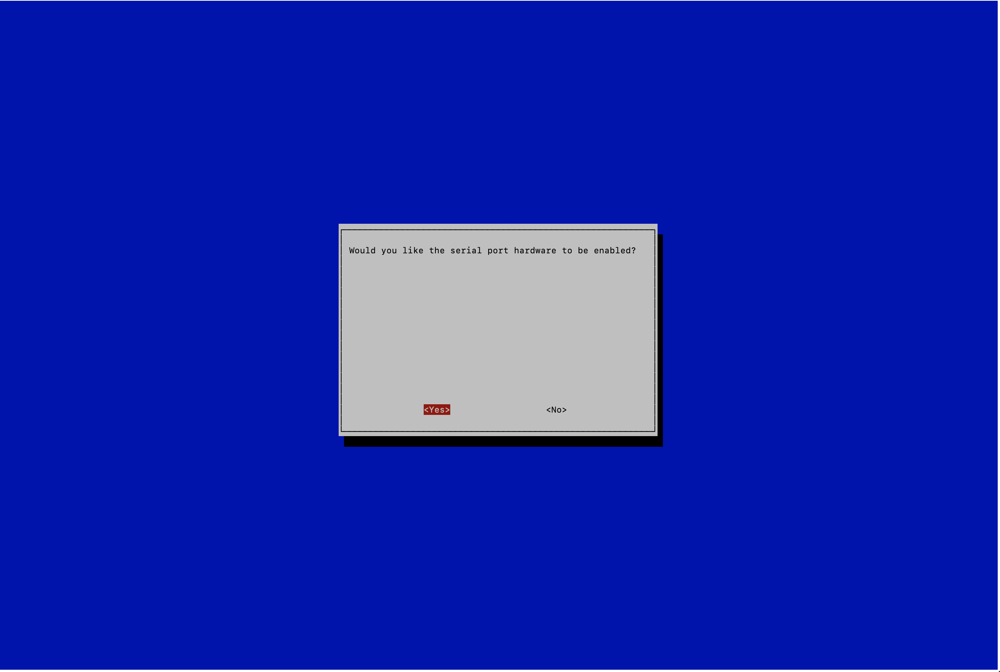
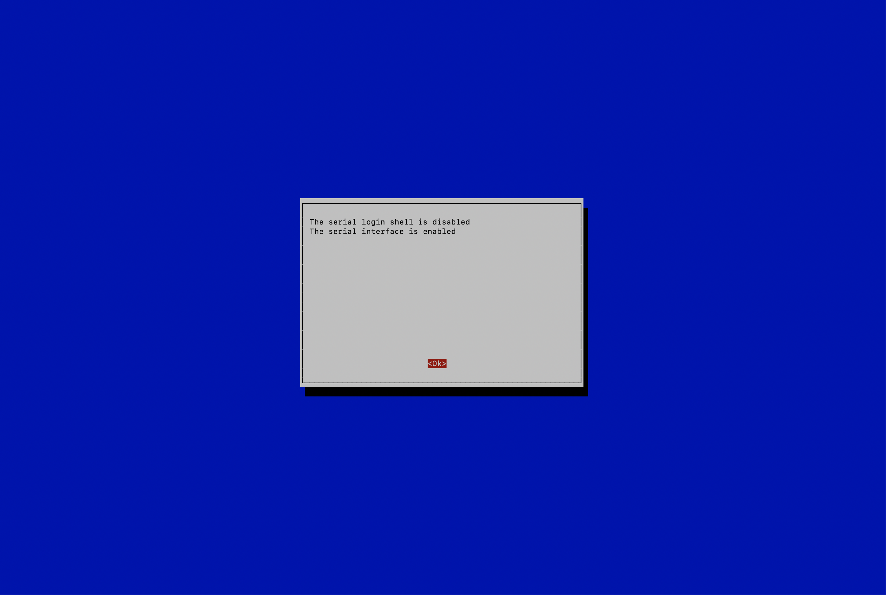

# Raspberry Pi Zero based Air Quality Monitoring Project

## Hardware [[1]](#ref_1), [[2]](#ref_2):

- 1 Raspberry Pi Zero WH (with pre-soldered header) - £ 13.50
- 1 Gravity: Analog Infrared CO2 Sensor For Arduino (0~5000 ppm) - £ 61.00
- 1 MCP3008 - 8-Channel 10-Bit ADC With SPI Interface - £ 3.00
- 1 Raspberry Pi Breadboard (Half Size) - £ 3.00
- 1 The Pi Hut Jumper Bumper Pack (120pcs Dupont Wire) - £ 6.00
- 1 Micro SD Card 16GB - £ 7.00
- PMS5003 Particulate Matter Sensor - £24.90
- Pimoroni Breakout board for PMS5003 Sensor - £2.99

We use a Raspberry Pi Zero WH as our microcontroller. Since it doesn't have an inbuilt Analog to Digital converter like Arduinos do we need to add an external ADC to our circuit for which we use the MCP3008.

## Setup

## Installation

#### Connect the Hardware [[3]](#ref_3), [[4]](#ref_4)

##### CO2 Sensor

Plug the MCP3008 ADC into the breadboard across the centre line.


We're going to connect the MCP3008 to the Raspberry Pi Zero using Software SPI. Use Male / Female Jumper wires to make the following connections:


    MCP3008 VDD to Raspberry Pi 3.3V
    MCP3008 VREF to Raspberry Pi 3.3V
    MCP3008 AGND to Raspberry Pi GND
    MCP3008 DGND to Raspberry Pi GND
    MCP3008 CLK to Raspberry Pi pin 18
    MCP3008 DOUT to Raspberry Pi pin 23
    MCP3008 DIN to Raspberry Pi pin 24
    MCP3008 CS/SHDN to Raspberry Pi pin 25

The last 4 MCP3008 connections (CLK, DOUT, DIN and CS/SHDN) are arbitrary on the Raspberry Pi side, they could be connected to any GPIO (General Purpose Input/Output) pins. If you do connect them to different pins you will need to modify the script below and other example scripts accordingly though so I recommend sticking with the suggested pins for now.

We then connect the Gravity Infrared CO2 Sensor.



<table style="width: 380px; margin-left: 100px" border="1">
  <thead>
    <tr>
      <th><p><strong>Pin No.<strong></p></th>
      <th><p><strong>Pin Name</strong></p></th>
      <th><p><strong>Description</strong></p></th>
    </tr>
  </thead>
  <tbody>
    <tr>
      <td>1</td>
      <td>Signal</td>
      <td>Analog Output (0.4~2V)</td>
    </tr>
    <tr>
      <td>2</td>
      <td>VCC</td>
      <td>VCC (4.5~5.5V)</td>
    </tr>
    <tr>
      <td>3</td>
      <td>GND</td>
      <td>GND</td>
    </tr>
  </tbody>
</table>
<br />

Using a Male / Male Jumper wire we connect the CO2 Sensor Signal output to Channel 1 on the MCP3008 via the breadboard.

Using Male / Female Jumper wires we connect the CO2 Sensor VCC and GND outputs directly to the Raspberry Pi Zero pins.
<br></br>

##### Particulate Sensor
Use Female / Female Jumper wires to make the following connections between the PMS5003 and the Raspberry Pi:


    PMS5003 VCC to Raspberry Pi 5V  (5V power +)
    PMS5003 GNDto Raspberry Pi GND (Ground -)
    PMS5003 TX to Raspberry Pi GPIO14 (UART0_TXD Serial Transmit)
    PMS5003 RX to Raspberry Pi GPIO15 (UART0_RXD Serial Receive)

We can leave EN and RESET unconnected.

All UARTs on the Raspberry Pi are 3.3V so these are directly compatible with the UART pins on the PMS5003 sensor without needing a level shift.

<br></br>

#### Prepare the Raspberry Pi OS [[5]](#ref_5)

Download the Raspberry Pi Imager from https://www.raspberrypi.org/software/ (Raspberry PI imager) and use it to write `Raspberry Pi OS with desktop and recommended software (32 bit)` (the default option) to the MicroSD card.

To enable SSH access place an empty file named <i> ssh </i> into the <i> boot </i>  folder of the <i> boot </i> partition.

```
touch /media/$USER/boot/ssh
```

Pre-configure WIFI access by adding a file named <i> wpa_supplicant.conf </i> there as well:

```
touch wpa_supplicant.conf
echo 'country=GB   
ctrl_interface=DIR=/var/run/wpa_supplicant GROUP=netdev
update_config=1

network={
   ssid="NETWORK-NAME"
   psk="NETWORK-PASSWORD"
}' > wpa_supplicant.conf

# Flush the write cache
sync
```

Where NETWORK-NAME is the SSID and NETWORK-PASSWORD the password of the WIFI network you want the Raspberry Pi Zero to connect to.

Now insert the MicroSD card into the Raspberry Pi Zero and connect power.

You should be able to connect to it from another device on the same network now using:

```
# Check the Pi is accessible (default name is raspberrypi or use its IP)
ping raspberrypi

# Access the Pi via SSH. The default password is 'raspberry'
ssh pi@raspberrypi
```

Change the default password using:

```
passwd

# Type your old and new password
```

and then run any available updates:

```
sudo apt-get update
sudo apt-get dist-upgrade
sudo apt-get clean
```

<br></br>

#### Install InfluxDB [[6]](#ref_6)

We're going to use InfluxDB as the timeseries database to store our sensor values. It'll be added as a data source in Grafana.

```
# Add the repo key
wget -qO- https://repos.influxdata.com/influxdb.key | sudo apt-key add -
```

```
# Add the repo to your sources
echo "deb https://repos.influxdata.com/debian buster stable" | sudo tee /etc/apt/sources.list.d/influxdb.list
```

```
sudo apt-get update && sudo apt-get install -y influxdb
```

Start the service using systemd and set the config file

```
sudo service influxdb start
```

```
influxd -config /etc/influxdb/influxdb.conf
```

```
echo $INFLUXDB_CONFIG_PATH /etc/influxdb/influxdb.conf
```

```
influxd
```

```
sudo service influxdb restart
```

Next we can use the InfluxDB CLI to check everything is working correctly and create our database ready to write to:

```
# Launch CLI
influx
```

```
create database air_quality
```

Your InfluxDB instance should now be available on `http://localhost:8086`

<br></br>

#### Install Grafana [[7]](#ref_7)

We're going to use Grafana to visualise our CO2 sensor data over time. The Raspberry PI is armv6 based, packages are available at https://grafana.com/grafana/download?platform=arm.

```
# Install dependencies
sudo apt-get install -y adduser libfontconfig1
```

```
# Download the .deb package
wget https://dl.grafana.com/oss/release/grafana-rpi_7.4.1_armhf.deb
```

```
# Install the downloaded package
sudo dpkg -i grafana-rpi_7.4.1_armhf.deb
```

Your Grafana instance should now be available on:
`http://raspberrypi:3000` or `http://<IP>:3000` from any device on the same network.

<br> </br>

##### Read CO2 Sensor Values and Write them to InfluxDB [[8]](#ref_8), [[9]](#ref_9), [[10]](#ref_10)

```
# Install dependencies
sudo apt-get install git build-essential python-dev
```

Install the MCP3008 library (https://github.com/adafruit/Adafruit_Python_MCP3008)

```
git clone https://github.com/adafruit/Adafruit_Python_MCP3008.git
cd Adafruit_Python_MCP3008
sudo python setup.py install
```

```
# Install InfluxDB Python library
pip install influxdb
```

Copy the provided `co2.py` script.

The script reads in the sensor value from Channel 1 on the ADC - if you've connected the Gravity Sensor Signal output to a different channel then adjust the code accordingly (line 27).

We then calculate the LSB (Least Significant Bit) size of the ADC using the formula:
```
LSB size = FSB * no_ADC_CODES
```

where:
 -  FSB is the Full Scale Range of the values we are representing. In this case our reference voltage is 3.3V (provided by the Raspberry Pi Zero), so our FSB is 3300mV.

 - no_ADC_CODES is the number of digital output codes/values the ADC has available to represent the FSB. In this case the MCP3008 we are using is a 10Bit ADC so we have 2^10 = 1024 codes available (0-1023).

We calculate the output voltage of the sensor by
 ```
 voltage = sensor_value * lsb_size
 ```

 i.e.

 ```
 voltage = sensor_value * (3300 / 1024.0)
 ```

 The Gravity Infrared CO2 Sensor V1.1 output signal has a range from 0.4V - 2V. If our calculated voltage is below 0.4V (400mV) we know the sensor is still pre-heating (~3 mins).

 If it's between 0.4V and 2V we need to convert it back to concentration in ppm.

 We do that by scaling our available output voltage values (1600mV) over the range of measurement values: 5000ppm (the Gravity Infrared CO2 Monitor V1.1 measures CO2 concentrations from 0-5000ppm):

 ```
 (voltage - 400) * 50.0 / 16.0
 ```

 Giving for example:

 ```
 (400mV - 400) * 50 / 16 = 0 ppm
 (800mV - 400) * 50 / 16 = 1250 ppm
 (1200mV - 400) * 50 / 16 = 2500 ppm
 (2000mV - 400) * 50 / 16 = 5000 ppm
 ```

 We calculate the associated error using the stated accuracy of the CO2 sensor (± 50ppm + 3%):

 ```
 error = 50 + ((calculated_concentration / 100) * 3)
 ```

This does not account for any additional error introduced by the ADC.

<br> </br>

##### Read Particulate Sensor values and write them to InfluxDB [[11]](#ref_11), [[12]](#ref_12), [[13]](#ref_13)

Install PMS5003 Python library
 ```
 git clone https://github.com/pimoroni/pms5003-python
 cd pms5003-python
 sudo ./install.sh
 ```

The Raspberry Pi Zero contains a UART serial port on the GPIO header on pins 8, TXD (GPIO 14) and 10, RXD (GPIO 15). We  need to disable login shell over serial and enable UART hardware.We use the raspi-config GUI to do this:
 ```
 sudo raspi-config
 ```

 Select “3 Interface Options”
 

 Select “P6 Serial Port”
 

 Select “No”
 

 Select “Yes”
 

 Select “Ok”
 

 Select "Reboot Now"


On the Raspberry Pi Zero there are two UART controllers that use the same pins, mini UART (` /dev/ttyS0`) and PL011 UART (`/dev/ttyAMA0`). By default the Pi is set to use mini UART and PL0111 is used for the Bluetooth module. The mini UART controller's baud rate is linked to the VPU core frequency so as the VPU frequency changes depending on processor load so does the baud rate of the UART controller. This will cause problems as serial devices expect a constant baud rate during communication so we need to use PL011 UART instead (the file output is  also hardcoded in the PMS5003 Python library).

Disable the Bluetooth module and map PL011 UART on pins 14 and 15. Add the following to the end of `/boot/config.txt`

 ```
dtoverlay=pi3-miniuart-bt
 ```

 and reboot.


 Copy the provided `pms.py` script.

 The script reads sensor data in over PL011 (`/dev/ttyAMA0` file in Linux) every 5 seconds and writes the values to InfluxDB.
 <br /> <br />

##### Use SystemD to start and run our Python script automatically

Copy the provided `/etc/systemd/system/` service files and then enable and start them:

The service file assumes that your python script for the CO2 monitor is located at `/home/$USER/Adafruit_Python_MCP3008/co2.py` and your python script for the particulate sensor is located at `/home/$USER/pms5003-python/pms.py`. If either is located elsewhere adjust the `ExecStart` command accordingly.

```
sudo systemctl daemon-reload
sudo systemctl enable co2_monitor.service
sudo systemctl start co2_monitor.service

sudo systemctl enable pms.service
sudo systemctl start pms.service
```


#### References with thanks
<a id="ref_1"></a>[1] https://thepihut.com/ <br />
<a id="ref_2 "></a>[2] https://coolcomponents.co.uk/ <br />
<a id="ref_3"></a>[3] https://raspberrypi.stackexchange.com/questions/83610/gpio-pinout-orientation-raspberypi-zero-w <br />
<a id="ref_4"></a>[4] https://learn.adafruit.com/raspberry-pi-analog-to-digital-converters/mcp3008 <br />
<a id="ref_5"></a>[5] https://qrys.ch/setting-up-a-raspberry-pi-zero-w-wh-the-headless-way-with-wifi-and-vnc/ <br />
<a id="ref_6"></a>[6] https://www.circuits.dk/install-grafana-influxdb-raspberry/ <br />
<a id="ref_7"></a>[7] https://computingforgeeks.com/install-influxdb-on-debian-10-buster-linux/ <br />
<a id="ref_8"></a>[8] https://circuitdigest.com/microcontroller-projects/interfacing-gravity-inrared-co2-sensor-to-measure-carbon-dioxide-in-ppm <br />
<a id="ref_9"></a>[9] https://e2e.ti.com/blogs_/archives/b/precisionhub/archive/2016/04/01/it-s-in-the-math-how-to-convert-adc-code-to-a-voltage-part-1 <br />
<a id="ref_10"></a>[10] https://projects-raspberry.com/interfacing-an-spi-adc-mcp3008-chip-to-the-raspberry-pi-using-c-spidev/
<a id="ref_11 "></a>[11] https://www.rigacci.org/wiki/doku.php/doc/appunti/hardware/raspberrypi_air <br />
<a id="ref_12 "></a>[12] https://pypi.org/project/pms5003/ <br />
<a id="ref_13 "></a>[13]  https://www.abelectronics.co.uk/kb/article/1035/raspberry-pi-3--4-and-zero-w-serial-port-usage <br />
