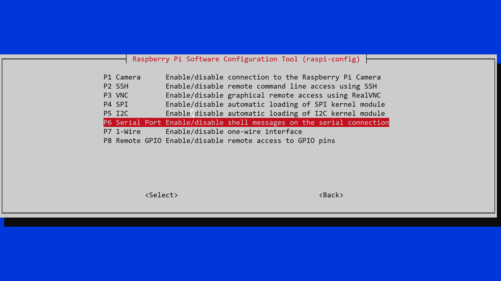
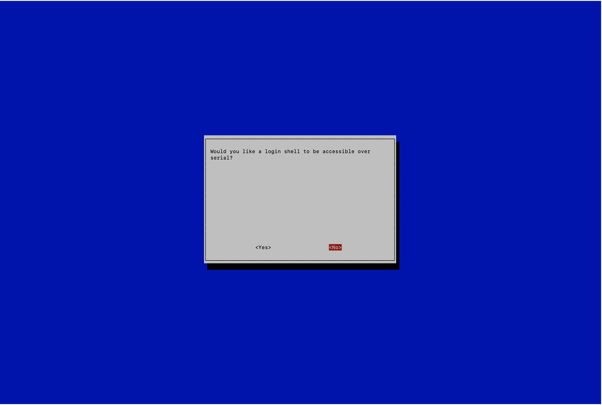

# Setup Guide Part II - Particulate Sensor

## Hardware [[1]](#ref_1), [[2]](#ref_2):

 - PMS5003 Particulate Matter Sensor - £24.90
 - Pimoroni Breakout board for PMS5003 Sensor - £2.99

 ## Setup

 ## Installation

 #### Connect the Hardware [[3]](#ref_3)

 Use Female / Female Jumper wires to make the following connections between the PMS5003 and the Raspberry Pi:


     PMS5003 VCC to Raspberry Pi 5V  (5V power +)
     PMS5003 GNDto Raspberry Pi GND (Ground -)
     PMS5003 TX to Raspberry Pi GPIO14 (UART0_TXD Serial Transmit)
     PMS5003 RX to Raspberry Pi GPIO15 (UART0_RXD Serial Receive)

 We can leave EN and RESET unconnected.

 All UARTs on the Raspberry Pi are 3.3V so these are directly compatible with the UART pins on the PMS5003 sensor without needing a level shift.


 #### Software Installation [[4]](#ref_4), [[5]](#ref_5)

Install PMS5003 Python library
 ```
 git clone https://github.com/pimoroni/pms5003-python
 cd pms5003-python
 sudo ./install.sh
 ```

The Raspberry Pi Zero contains a UART serial port on the GPIO header on pins 8, TXD (GPIO 14) and 10, RXD (GPIO 15). We  need to disable login shell over serial and enable UART hardware.We use the raspi-config GUI to do this:
 ```
 sudo raspi-config
 ```

 Select “3 Interface Options”
 

 Select “P6 Serial Port”
 

 Select “No”
 

 Select “Yes”
 

 Select “Ok”
 

 Select "Reboot Now"


On the Raspberry Pi Zero there are two UART controllers that use the same pins, mini UART (` /dev/ttyS0`) and PL011 UART (`/dev/ttyAMA0`). By default the Pi is set to use mini UART and PL0111 is used for the Bluetooth module. The mini UART controller's baud rate is linked to the VPU core frequency so as the VPU frequency changes depending on processor load so does the baud rate of the UART controller. This will cause problems as serial devices expect a constant baud rate during communication so we need to use PL011 UART instead (the file output is  also hardcoded in the PMS5003 Python library).

Disable the Bluetooth module and map PL011 UART on pins 14 and 15. Add the following to the end of `/boot/config.txt`

 ```
dtoverlay=pi3-miniuart-bt
 ```

 and reboot.


 #### References with thanks
 <a id="ref_1"></a>[1] https://thepihut.com/ <br />
 <a id="ref_2 "></a>[2] https://coolcomponents.co.uk/ <br />
 <a id="ref_3 "></a>[3] https://www.rigacci.org/wiki/doku.php/doc/appunti/hardware/raspberrypi_air <br />
<a id="ref_4 "></a>[4] https://pypi.org/project/pms5003/ <br />
<a id="ref_5 "></a>[5]  https://www.abelectronics.co.uk/kb/article/1035/raspberry-pi-3--4-and-zero-w-serial-port-usage <br />
